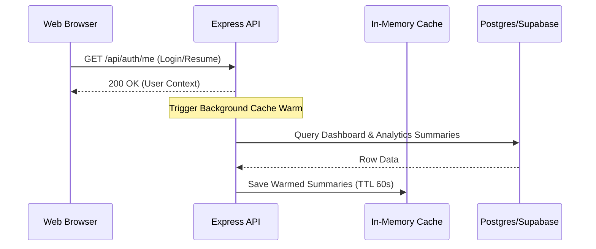

# Cache Warming Architecture (Vantro Flow)

This document establishes the cache warming and precomputation guidelines to ensure the Vantro Flow application achieves dashboard response latencies under **150ms** for active businesses.

---

## 1. Core Objectives
*   **Zero-Latency Dashboard**: Active businesses should hit warmed in-memory summaries instantly on load instead of triggering heavy database scans.
*   **User-Scoped Isolation**: Ensure cache keys never bleed across business IDs.
*   **Non-Blocking Executions**: Under no circumstances should warming queries block client web requests or cause server crashes.

---

## 2. Dynamic Warming Triggers & Lifecycle

We utilize a multi-layered warming process:



### A. Eager Load (Login & Resume Session)
*   When a user authenticates or calls the session verification endpoint (`/api/auth/me`), a non-blocking eager-load cycle triggers `warmBusinessCache(userId)` in the background.
*   This precomputes metrics for:
    *   `/api/business/control-room` (Control Room dashboard data)
    *   `/api/analytics/:userId` (Analytics graphs)

### B. Event-Driven Invalidation & Refills
*   When transactional writes occur (`sale.created`, `purchase.created`, `invoice.paid`, etc.), they emit events via `emitBusinessEvent(userId)`.
*   This instantly invalidates the user's cached values, ensuring that subsequent requests get fresh, computed database metrics.

---

## 3. Scale Plan: Background Workers & Redis (Future State)
As active user volumes scale past 1,000+ businesses, simple in-process promises will incur memory overhead.

### BullMQ Queue Configuration
*   We will introduce a `cache-warming` queue using **BullMQ** and **Redis**.
*   Warming tasks will be dispatched to separate worker processes, completely isolating API threads from database calculation workloads.

```javascript
// Future background job dispatcher
const cacheWarmingQueue = new Queue('cache-warming', { connection: redisClient });

async function enqueueCacheWarm(userId) {
  await cacheWarmingQueue.add('warm-metrics', { userId }, {
    attempts: 3,
    backoff: 5000,
    removeOnComplete: true,
  });
}
```
