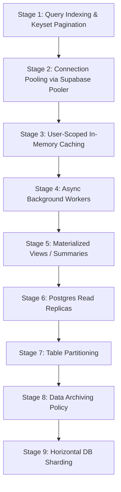

# Database Scaling Roadmap (Vantro Flow)

This document establishes the strategic time-phased stages for scaling Vantro Flow's database architecture from MVP (Single Supabase instance) to a highly concurrent distributed database cluster supporting millions of historical records.

---

## 1. Time-Phased Scaling Stages

### Stage 1: Query Indexing & Keyset Pagination
*   **Actions**: Implement standard database indexes (DDL listed in `DATABASE_PERFORMANCE_PLAN.md`) and modify Express lists to enforce `LIMIT`/`OFFSET` queries.
*   **Scale Target**: $<100$ QPS.

### Stage 2: Connection Pooling (Supabase Pooler)
*   **Actions**: Migrate database query strings from port `5432` to transaction mode pooler port `6543`.
*   **Scale Target**: $<200$ QPS, $50+$ concurrent server workers.

### Stage 3: User-Scoped In-Memory Caching & Warming
*   **Actions**: Deploy short-lived TTL caches on dynamic GET calculations and eager pre-warming hooks on session resume.
*   **Scale Target**: $500$ QPS, $<1,000$ active businesses.

### Stage 4: Background Jobs & Workers
*   **Actions**: Decouple heavy parsing and third-party integrations (OCR, Twilio reminders, AI calculations) to asynchronous bg workers.
*   **Scale Target**: $5,000+$ daily transactions.

### Stage 5: Materialized Views
*   **Actions**: Deploy daily-computed or trigger-refreshed materialized summary tables for dashboard analytics, completely eliminating real-time aggregate overhead.
*   **Scale Target**: $10,000+$ daily active users.

### Stage 6: Postgres Read Replicas
*   **Actions**: Introduce read replica instances. Configure backend route routing to send writes (`POST`/`PATCH`/`DELETE`) to the primary database master and reads (`GET`) to read replicas.
*   **Scale Target**: $1,000+$ QPS.

### Stage 7: Table Partitioning
*   **Actions**: Partition large tables by date ranges or user ID buckets to keep active indices small:
    *   `activity_logs` (partitioned monthly)
    *   `stock_movements` (partitioned quarterly)
    *   `bank_transactions` (partitioned by business ID range)
*   **Scale Target**: $10,000,000+$ total rows.

### Stage 8: Data Archiving Policy
*   **Actions**: Move transactional logs and messages older than 1 year to cold storage (e.g., Supabase Storage Buckets, AWS S3, or cheap data lake tables).
*   **Scale Target**: Maintain query latency bounds indefinitely.

### Stage 9: Horizontal Database Sharding
*   **Actions**: Distribute records across multiple physical database instances.
*   **Scale Target**: $10,000+$ QPS, millions of active daily business ledgers.

---

## 2. Horizontal Sharding Deep Dive

### When to Shard?
Sharding should be deferred as long as possible. We will only shard when a single massive PostgreSQL instance (even with 64+ cores, TBs of RAM, read replicas, and partitioning) saturates physical CPU/Disk I/O capacity.

### What Key to Shard On?
*   **Shard Key**: `business_id` / `user_id`.
*   **Why**: Vantro Flow is a multi-tenant business application. A business ledger is completely independent of other businesses. Grouping all records (`sales`, `purchases`, `invoices`, `stock_movements`) belonging to a single `business_id` on the same physical shard ensures that queries never need to perform expensive cross-node network joins.

### Risks & Challenges of Sharding
1.  **Cross-Shard Queries**: Aggregating metrics across *all* tenants (such as for platform-wide admin metrics) becomes slow and requires building a dedicated Data Warehouse / ETL stream.
2.  **Schema Migrations**: Running DDL changes requires executing them safely across all shards in atomic sequence.
3.  **Tenant Rebalancing**: If a specific enterprise business shard grows extremely large, we must execute complex online data migrations to move that tenant to a dedicated physical server without downtime.

---

## 3. Why Sharding is NOT Recommended Now
At Vantro Flow's current scale:
*   A single standard Postgres instance easily supports up to 10,000+ active businesses if indices, caches, and connection poolers are properly configured.
*   Introducing sharding prematurely introduces massive architecture complexity, increases infrastructure costs by 10x, and degrades developer agility.
