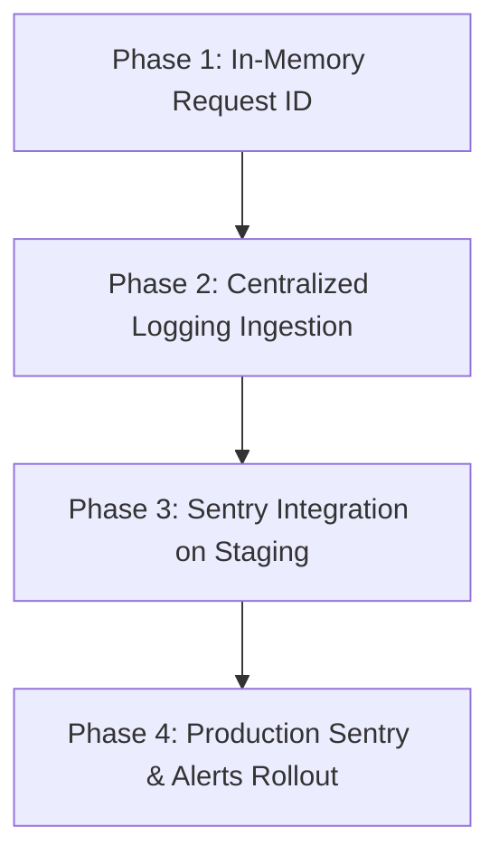

# Observability & Logging Roadmap (Vantro Flow)

This document establishes the observability standard and transition plan for Vantro Flow backend and frontend systems under high load.

---

## 1. Current Logging Status & Limitations
*   **Console Logging**: The application currently uses unstructured `console.log` and `console.error` logs.
*   **Visibility Gap**: Without standard parsing formats, searching across logs to identify occurrences of specific errors for a business or a route requires scanning thousands of lines manually.
*   **Traceability**: Prior to Phase 1, there was no way to trace a client's frontend error request directly to a specific backend database failure or API delay.

---

## 2. Unseen Failures (What is Invisible Today?)
Without structured error boundaries and log streams:
1.  **Silent Failures in In-line Reconciliation**: Failures within `ensureConnectedBusinessData` backfills fail silently without logging full context, leaving stock ledger entries unpopulated.
2.  **API Rate Limiting 429 Drops**: When users hit rate-limit restrictions, we cannot easily correlate if a particular client is experiencing constant blocks or if malicious clients are trying to exhaust our endpoints.
3.  **Supabase REST Endpoint Timeouts**: Supabase REST requests that hang or timeout do not report failure metrics cleanly, leaving users with infinite loading skeleton screens.

---

## 3. Recommended Tooling Strategy

### Error Tracking
*   **Sentry (Frontend & Backend)**: Recommended primary tool for capturing unhandled runtime exceptions. Sentry maps stack traces back to frontend TypeScript sources via source maps and groups identical errors.
    *   *Free Tier limits*: Up to 5,000 events/month (adequate for startup scale).

### Tracing
*   **OpenTelemetry (APM)**: Tracing database connection times, Supabase REST responses, and middleware latency.
    *   *Alternative*: Standard Node.js performance hooks (`process.hrtime`) combined with structured API logging, which incurs zero performance overhead and zero dollar cost.

### Centralized Logging
*   **Logtail (Better Stack) or Datadog**: Allows stream ingestion from Railway and Vercel consoles.
    *   *Railway/Vercel standard native logs*: Highly robust and free out-of-the-box. We can capture console logs directly on the platform without setting up external agents.

---

## 4. High-Value Data to Capture
Every log must include:
*   `requestId`: The unique trace UUID generated per request.
*   `method` / `path` / `status`: Standard HTTP request signature.
*   `durationMs`: Milliseconds spent handling the API logic.
*   `userId` / `businessId`: Traced safely as anonymized UUIDs.
*   `frontendRoute` / `browser`: Captured from client request headers.

---

## 5. Security & Privacy Constraints (What NOT to Capture)

> [!CAUTION]
> **PII & Credential Leaks**: Under no circumstances should logs ever capture:
> *   Cleartext passwords or password hashes.
> *   Full JWT tokens or session authorization headers.
> *   OTP code digits.
> *   Sensitive financial details (raw customer transaction amounts or personal identity details) unless explicitly aggregated.

---

## 6. Implementation & Rollout Plan

### Rollout Milestones
1.  **Staging Environment Verification**:
    *   Configure Railway and Vercel consoles to stream runtime logs to a unified log stream (e.g., Logtail free tier).
    *   Ensure all API request formats adhere to the `[API_REQUEST]` JSON layout.
2.  **Production Gate Activation**:
    *   Initialize Sentry SDKs with an event rate sampler of 10% to stay within free limits and prevent performance drag on heavy routes.

---

## 7. Cost & Risk Assessment
*   **Direct Cost**: **$0** (utilizing free tiers of Sentry and Better Stack / native Railway logs).
*   **Performance Risk**: **Low**. Using async in-process console streams avoids locking thread loops.
*   **Rollback Path**: To disable external tracing, Sentry hooks can be disabled remotely via setting environment variables (`SENTRY_ENABLED=false`).
