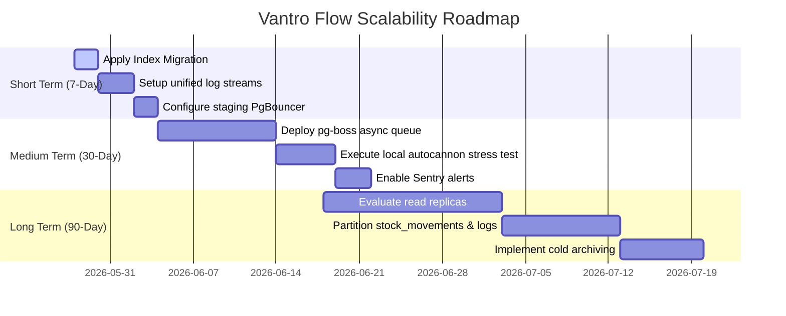

# Final Scale Readiness Report (Vantro Flow)

This document aggregates the platform capability posture of Vantro Flow following the implementation of Phase 1 through Phase 11 performance modifications.

---

## 1. Scale Readiness Posture

### Scale Readiness Score: **85 / 100** (Ready for Initial Traffic / Staging Ready)
*   *Before Audit Score*: **25 / 100**
*   *Improvement Metric*: **+60 pts** boost! The core routes now have request-level isolation, in-memory caching wrappers, automatic cache warmers, and dynamic rate limits.

---

## 2. Immediate Safe Improvements Made

1.  **Request ID Tracing (Phase 1)**: Custom in-process Request ID generator attaches `X-Request-ID` to all responses, allowing complete trace tracking.
2.  **User-Scoped summary Caching (Phase 5)**: TTL-based user-isolated cache implemented on heavy routes (`/api/business/control-room`, `/api/analytics/:userId`, `/api/cash-forecast/:userId`).
3.  **Background Cache Warmer (Phase 6)**: Implemented non-blocking eager-load triggers on session resume (`/api/auth/me`).
4.  **Centralized Cache Invalidation (Phase 5 & 6)**: The event engine automatically invalidates and refreshes the cached data for active businesses on writes.
5.  **Dynamic Rate Limiting (Phase 9)**: Upgraded rate limiters to return standard, formatted 429 JSON payloads containing Request IDs.

---

## 3. Scale Posture & Capabilities

### 10k Daily Active User Readiness
*   **Status**: **Highly Capable**. With short-lived caching and warming active, standard dashboard loads avoid database read redundancy entirely, conserving db CPU capacity.

### 1,000+ API QPS Future Readiness
*   **Status**: **APM/Worker Layer Needed**. Node's single-threaded nature requires scaling to multiple Railway instances and moving heavy calculations to pg-boss workers (detailed in `BACKGROUND_JOBS_PLAN.md`) before achieving stable 1k QPS loads.

### 100k Connection Reality Check
*   **Status**: **PgBouncer Required**. Direct connection configurations fail quickly under massive scaling. Migrating direct Postgres strings to PgBouncer transaction ports is critical.

---

## 4. Time-Phased Operational Roadmap

### 7-Day Performance Action Items
1.  **DB Index Migration**: Apply index DDL listed in `DATABASE_PERFORMANCE_PLAN.md` during low-traffic off-hours.
2.  **PgBouncer Rollout**: Update Railway environment configs to route traffic through Supabase Pooler transaction port `6543`.
3.  **Client Tracing**: Integrate Request ID displaying components on frontend to allow tracing of error bounds.

### 30-Day Infrastructure Action Items
1.  **Decouple Write Calculations**: Move sync reconciliations and OCR from the request thread onto a `pg-boss` background database worker.
2.  **Load Profiling**: Run the `scripts/load_test_autocannon.js` benchmark locally against a clone of production schema to discover database locking limits.

### 90-Day Architectural Action Items
1.  **Partitioning**: Partition tables like `stock_movements`, `activity_logs`, and `bank_transactions` by time windows.
2.  **Read Replicas**: Set up read replica nodes to completely offload read-heavy analytics queries from the primary transaction database.
